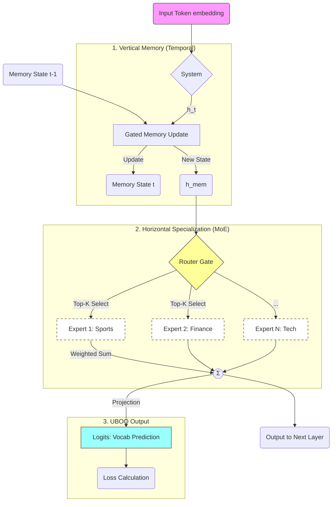

# MM-Rec Neuron Schematics (The "Block")

Bu şema, modelin temel yapı taşı olan `MMRecBlock` ("Nöron") mimarisini gösterir.

## Bileşenler

### 1. Gated Memory (Zaman Ekseni)
Standart bir nöronun aksine, bu blok "hatırlama" yeteneğine sahiptir. `GatedMemory` ünitesi, GRU benzeri kapılarla gelen bilgiyi eski hafıza ile birleştirir ($h_t + M_{t-1} \to M_t$).

### 2. MoE (Uzmanlık Ekseni)
Hafızadan çıkan bilgi, **sabit bir işlemden geçmek yerine**, içeriğine göre farklı "Uzmanlara" (Experts) yönlendirilir.
- **Router:** "Bu token sporla ilgili, Uzman 1'e gitsin" der.
- **Dynamic Routing:** Sadece seçilen uzmanlar çalışır (CPU dostu).

### 3. UBOO (Holografik Çıktı)
Her nöron (blok), sadece bir sonraki katmana bilgi göndermekle kalmaz, aynı zamanda **doğrudan tahmin yapmaya çalışır.** Bu, modelin her katmanının "anlamlı" bilgi taşımasını zorunlu kılar.
